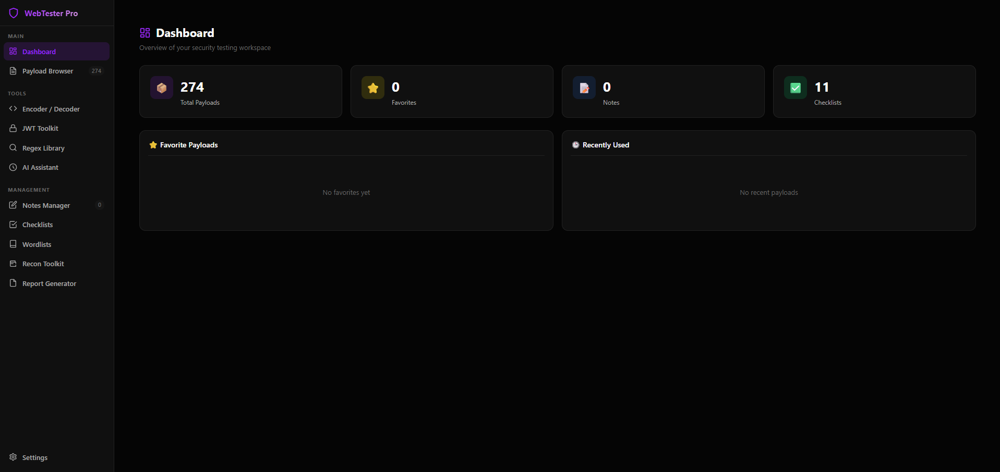
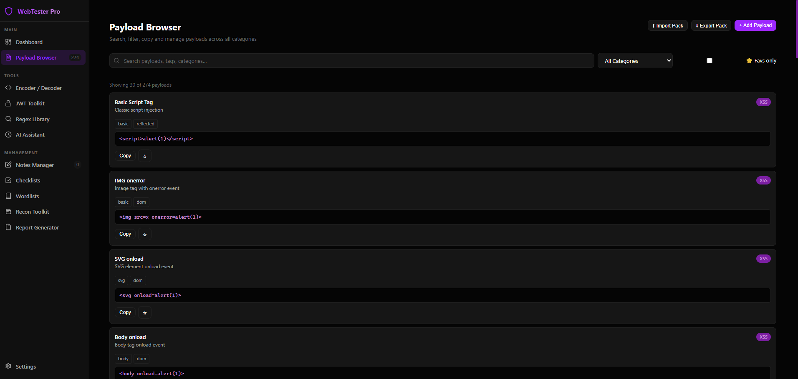
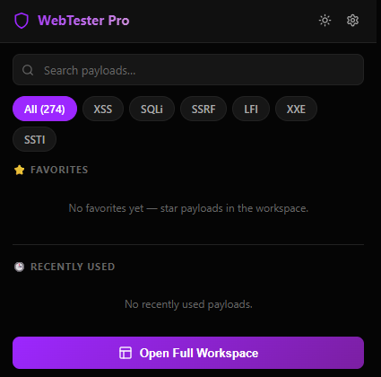
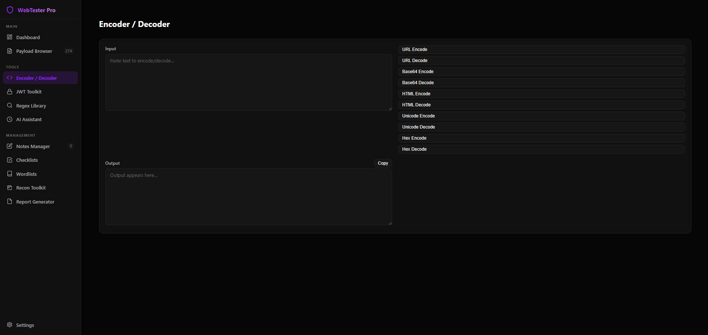
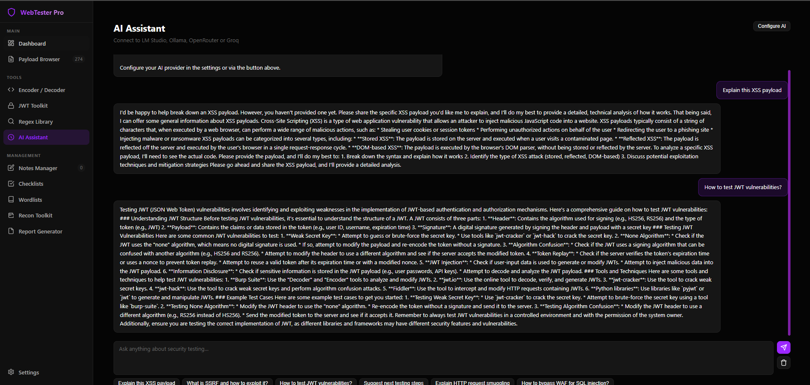

# WebTester Pro

**DEVELOPED BY JOJIN JOHN**

WebTester Pro is a cross-browser web security testing extension for Firefox, Chrome, Edge, and Brave. It gives bug bounty hunters, penetration testers, and security learners a compact toolkit for payloads, encoding, JWT review, notes, reports, and recon references directly inside the browser.

> Use this extension only on systems you own or where you have explicit written permission to test.

## Documentation

Full documentation and screenshots:

https://jojin1709.github.io/WEB-TESTER-EXENSION/

## Support And Connect

- LinkedIn: https://www.linkedin.com/in/jojin-john
- Buy Me a Coffee: https://www.buymeacoffee.com/jojin1709

<a href="https://www.buymeacoffee.com/jojin1709"></a>

## Download

Firefox users can install directly from Mozilla Add-ons:

**Firefox Add-ons:** https://addons.mozilla.org/en-US/firefox/addon/webtester-pro/

You can also go to the **Releases** page and download the package for your browser:

| Browser | Download asset | Install method |
|---|---|---|
| Firefox | [Mozilla Add-ons](https://addons.mozilla.org/en-US/firefox/addon/webtester-pro/) or `WebTesterPro.xpi` | Add to Firefox or XPI install |
| Chrome | `WebTesterPro-Chrome.zip` | Load unpacked extension |
| Edge | `WebTesterPro-Chrome.zip` | Load unpacked extension |
| Brave | `WebTesterPro-Chrome.zip` | Load unpacked extension |
| Source | `WebTesterPro-Source.zip` | Developer source archive |

## Screenshots

### Full Workspace Dashboard



### Payload Browser



### Compact Popup



### Encoder / Decoder



### AI Assistant



## Features

| Module | What it does |
|---|---|
| Payload Browser | Search, copy, favorite, import, and export security payloads |
| Encoder / Decoder | URL, Base64, HTML, Unicode, and Hex conversion |
| JWT Toolkit | Decode JWTs and review common weak spots |
| Regex Library | Patterns for secrets, tokens, cloud keys, JWTs, IPs, and more |
| AI Assistant | Optional OpenRouter, Groq, Ollama, and LM Studio support |
| Notes Manager | Markdown notes with tags and target context |
| Checklist Manager | Security testing checklists with progress tracking |
| Wordlist Manager | Upload, search, and export wordlists |
| Recon Toolkit | Command references for common recon tools |
| Report Generator | Draft report templates for common bounty platforms |
| Context Menu | Right-click helpers for payloads and analysis |
| Firefox Sidebar | Quick access sidebar in Firefox |

## Install In Firefox

### Mozilla Add-ons

1. Open https://addons.mozilla.org/en-US/firefox/addon/webtester-pro/
2. Click **Add to Firefox**.
3. Confirm the install prompt.

### Temporary testing

1. Download `WebTesterPro-Firefox.zip` from Releases.
2. Extract the ZIP file.
3. Open `about:debugging` in Firefox.
4. Select **This Firefox**.
5. Click **Load Temporary Add-on...**.
6. Select the extracted `manifest.json`.

### XPI install

1. Download `WebTesterPro.xpi` from Releases.
2. Open `about:addons`.
3. Click the gear icon.
4. Select **Install Add-on From File...**.
5. Choose `WebTesterPro.xpi`.

Firefox may require a signed extension for permanent installation in regular release builds. For local development, use temporary loading or Firefox Developer Edition/Nightly with your own settings.

## Install In Chrome, Edge, Or Brave

1. Download `WebTesterPro-Chrome.zip` from Releases.
2. Extract the ZIP file.
3. Open your extension page:
   - Chrome: `chrome://extensions`
   - Edge: `edge://extensions`
   - Brave: `brave://extensions`
4. Enable **Developer mode**.
5. Click **Load unpacked**.
6. Select the extracted `WebTesterPro-Chrome` folder.

## AI Setup

The extension works offline without AI. AI features are optional and only call the provider you configure.

| Provider | Base URL example | Model example |
|---|---|---|
| OpenRouter | `https://openrouter.ai/api/v1` | `mistralai/mixtral-8x7b-instruct` |
| Groq | `https://api.groq.com/openai/v1` | `llama3-70b-8192` |
| Ollama | `http://localhost:11434/v1` | `llama3` |
| LM Studio | `http://localhost:1234/v1` | `local-model` |

Configure AI inside the extension settings.

## Repository Layout

```text
WebTesterPro-Firefox/   Firefox-ready extension package
WebTesterPro-Chrome/    Chrome, Edge, and Brave-ready extension package
WebTesterPro-Source/    Source files and build scripts
WebTesterPro.xpi        Firefox XPI package
```

## Build

Use the cross-platform release builder from the repository root:

```bash
python scripts/build_release.py
```

Build output is written to `release/`. The builder writes ZIP entries with forward-slash paths so Firefox AMO accepts the package.

## Security And Privacy

- No telemetry.
- Extension data is stored locally in browser storage.
- No `eval()`.
- Content security policy restricts scripts to extension files.
- AI requests are made only when you configure and use an AI provider.

## Responsible Use

WebTester Pro includes offensive security payloads and testing utilities. Only use it for legal, authorized testing, such as your own applications, lab environments, bug bounty targets in scope, or client systems where you have written permission.

## License

Copyright (c) 2026 Jojin John. All rights reserved.

This project is proprietary. You may download and use official releases for personal, educational, and authorized security testing only. Copying, modifying, redistributing, rebranding, selling, or claiming this work as your own is not permitted without written permission from Jojin John.

See [LICENSE](./LICENSE) for the full terms.

## Author

**DEVELOPED BY JOJIN JOHN**

GitHub: [jojin1709](https://github.com/jojin1709)
LinkedIn: [jojin-john](https://www.linkedin.com/in/jojin-john)
